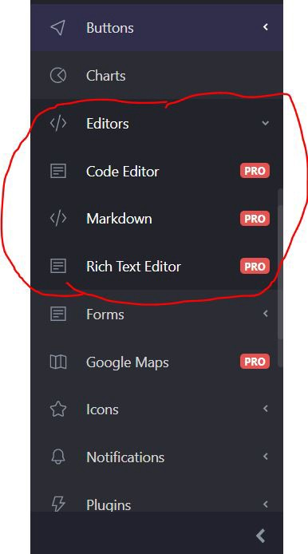
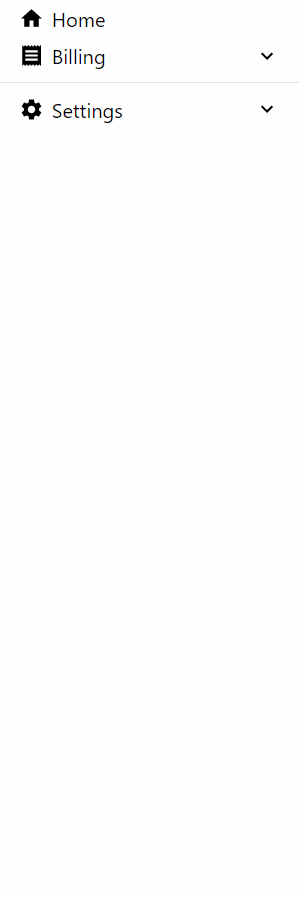
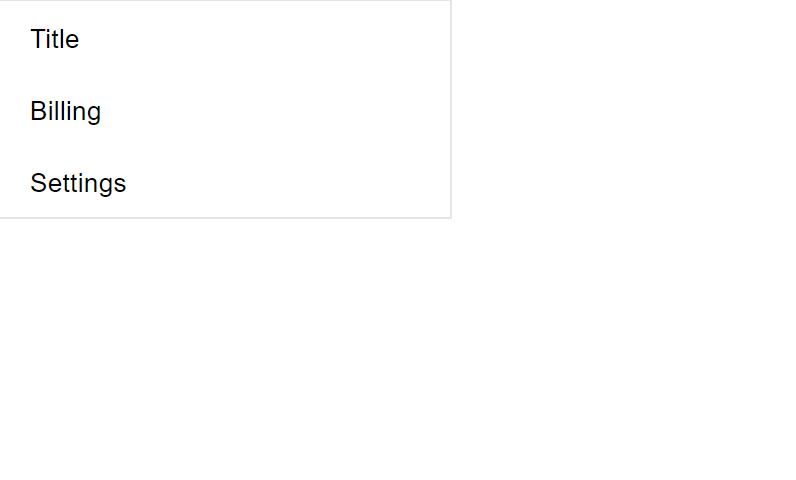
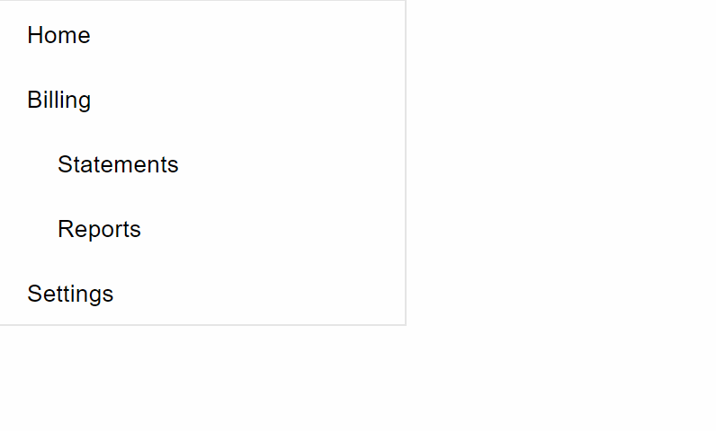
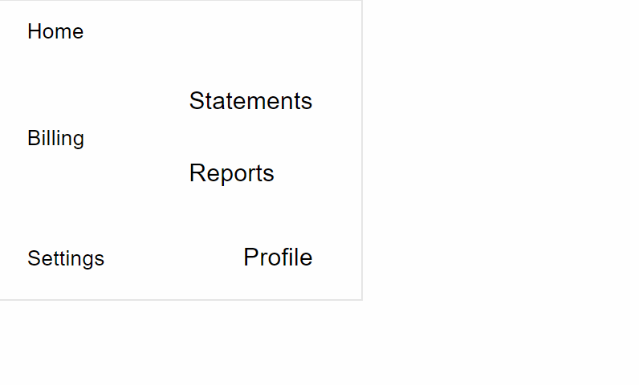
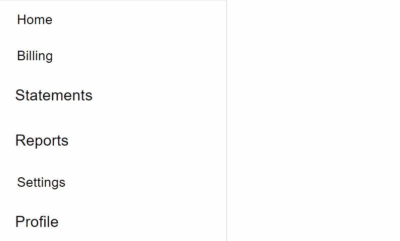

# Create a Modern Dynamic Sidebar Menu in React Using Recursion

## The power of recursion in React


Sidebars in web pages are among one of the most useful components that exist on the page due to their navigational functionality.

Today we will be building a modern sidebar in react using recursion. Recursion is a technique in which a function simply calls itself repeatedly until a condition has been met. The three rules of recursion apply when using recursion in this post:

- The function should have a condition that self destructs itself.
- The function should have a base condition.
- The function should be calling itself.

Sidebars are indeed essential to a web page, even if their level of attention does not come first. This is because they can help users navigate in different ways, such as content, that they may be interested in as opposed to a logical navigational menu.

But why would we even want to use recursion for sidebars? What difference does it make as opposed to writing out your sidebar items manually? If you’ve browsed through the internet for a while, you might have come across a website’s sidebar and realized that some sidebar items have subsections. Some sites have sidebars that hide or render certain items based on the page route the user navigated to. That is powerful!

For example, if we look at the image below inside the red circle, the Editors part is an item of the sidebar, and the three items following immediately below (Code Editor, Markdown, Text Editor) are the subsections:



You will see by the end of this post that this seemingly complicated sidebar is actually under 50 lines of code. What?!

Here is a basic example of how you can extend the sidebar component from this post to be a little more stylish while still retaining the clean feel of it:



Without further ado, let’s get started.

In this tutorial, we are going to quickly generate a React project with create-react-app.

Go ahead and create a project using the command below. For this tutorial i’ll call our project modern-sidebar.

```javascript
npx create-react-app modern-sidebar
```

Now go into the directory once it’s done:

```javascript
cd modern-sidebar
```

Inside the main entry src/index.js we're going to clean it up a bit so we can focus on the component alone:

```javascript
import React from 'react'
import ReactDOM from 'react-dom'
import App from './App'
import './styles.css'
import * as serviceWorker from './serviceWorker'
ReactDOM.render(<App />, document.getElementById('root'))
serviceWorker.unregister()
```

Now create src/App.js:

```javascript
import React from 'react'
const App = () => <div />
export default App
```

App will be importing and using our Sidebar component by creating Sidebar.js, so lets go ahead and create that:

```javascript
import React from 'react'
function Sidebar() {
  return null
}
export default Sidebar
```

Now I’m going to install a CSS library, but you can actually achieve the same working functionality of the sidebar that we will be building without it. The reason I’m doing this is that I like seeing the additional ripple effects in addition to having icons readily available to use.

```javascript
npm install @material-ui/core @material-ui/icons
```

Once that is installed, we need to think of a base structure in the user interface that our sidebar will be built upon. A solution is to use the unordered list (```<ul>```) element that renders list items (```<li>```). We will import List and ListItem from @material-ui/core since the List component is essentially a ul element, and the ListItem component is essentially a li.

Let's start off hardcoding a couple of items in the sidebar to visualize how this might look like to boost our confidence. Sometimes a little extra confidence can help improve our productivity:

```javascript
import React from 'react'
import List from '@material-ui/core/List'
import ListItem from '@material-ui/core/ListItem'
import ListItemText from '@material-ui/core/ListItemText'

function Sidebar() {
  return (
    <List disablePadding dense>
      <ListItem button>
        <ListItemText>Home</ListItemText>
      </ListItem>
      <ListItem button>
        <ListItemText>Billing</ListItemText>
      </ListItem>
      <ListItem button>
        <ListItemText>Settings</ListItemText>
      </ListItem>
    </List>
  )
}

export default Sidebar
```

disablePadding and dense were used to slightly shrink the size of each of the items, and the button prop was used to add the stunning ripple effect.
This is what we have so far:



Now that we have boosted our confidence, let’s go ahead and define props.items, which Sidebar will consume to render its items.
With that said, we’re also going to expect an items prop, which is an array of objects representing each item in the sidebar menu. We want to keep the functionality as simple as possible or else we could quickly overcomplicate the component.
Let’s first create items in the App component and pass it as props.items to Sidebar:

```javascript
import React from 'react'
import Sidebar from './Sidebar'

const items = [
  { name: 'home', label: 'Home' },
  { name: 'billing', label: 'Billing' },
  { name: 'settings', label: 'Settings' },
]

function App() {
  return (
    <div>
      <Sidebar items={items} />
    </div>
  )
}

export default App
```

We will now update the Sidebar component to reflect this array structure:

```javascript
import React from 'react'
import List from '@material-ui/core/List'
import ListItem from '@material-ui/core/ListItem'
import ListItemText from '@material-ui/core/ListItemText'

function Sidebar({ items }) {
  return (
    <List disablePadding dense>
      {items.map(({ label, name, ...rest }) => (
        <ListItem key={name} button {...rest}>
          <ListItemText>{label}</ListItemText>
        </ListItem>
      ))}
    </List>
  )
}

export default Sidebar
```

One thing you might have noticed is that our sidebar is just too dang big. Sidebars usually take up one side of the screen, so what we’re going to do is shrink its width to a suitable size. We will go ahead and put a max-widthof 200px on it. So we're going to create a div element that wraps our Listcomponent.

The reason why we create another div element instead of directly applying the styles on the List component is because we don't want to make Listresponsible for the width size. This way, in the future we can choose to abstract the List into a reusable sidebar component where it is able to adapt to any size depending on the size of the parent element:

Here is the Sidebar.js component:

```javascript
import React from 'react'
import List from '@material-ui/core/List'
import ListItem from '@material-ui/core/ListItem'
import ListItemText from '@material-ui/core/ListItemText'

function Sidebar({ items }) {
  return (
    <div className="sidebar">
      <List disablePadding dense>
        {items.map(({ label, name, ...rest }) => (
          <ListItem key={name} button {...rest}>
            <ListItemText>{label}</ListItemText>
          </ListItem>
        ))}
      </List>
    </div>
  )
}

export default Sidebar
```

And inside index.css we defined the CSS styles for the sidebar class:

```css
.sidebar {
  max-width: 240px;
  border: 1px solid rgba(0, 0, 0, 0.1);
}
```

Material-UI actually uses its own CSS styling mechanism using the CSS-in-JS approach, but we will stick to regular CSS in this article to keep things from being unnecessarily complicated.

We can already just leave it as basic as this and call it a day. However, it doesn’t support subitems. We want to be able to click on a sidebar item and have it drop down its list of sub items if it has any. Having subitems helps organize the sidebar by grouping additional items within another sidebar section:



The way we are going to support this feature is to allow another option inside each sidebar item that the component will use to detect for its subitems. (Can you feel the recursion coming?)

Let’s change up our items array in the App component to pass in subitems:

```javascript
import React from 'react'
import Sidebar from './Sidebar'

const items = [
  { name: 'home', label: 'Home' },
  {
    name: 'billing',
    label: 'Billing',
    items: [
      { name: 'statements', label: 'Statements' },
      { name: 'reports', label: 'Reports' },
    ],
  },
  {
    name: 'settings',
    label: 'Settings',
    items: [{ name: 'profile', label: 'Profile' }],
  },
]

function App() {
  return (
    <div>
      <Sidebar items={items} />
    </div>
  )
}

export default App
```

To be able to render a sidebar item’s subitems, we’d have to watch for the items property when rendering sidebar items:

```javascript
function Sidebar({ items }) {
  return (
    <div className="sidebar">
      <List disablePadding dense>
        {items.map(({ label, name, items: subItems, ...rest }) => (
          <ListItem style={{ paddingLeft: 18 }} key={name} button {...rest}>
            <ListItemText>{label}</ListItemText>
            {Array.isArray(subItems) ? (
              <List disablePadding>
                {subItems.map((subItem) => (
                  <ListItem key={subItem.name} button>
                    <ListItemText className="sidebar-item-text">
                      {subItem.label}
                    </ListItemText>
                  </ListItem>
                ))}
              </List>
            ) : null}
          </ListItem>
        ))}
      </List>
    </div>
  )
}
```

And now… behold, our dazzling sidebar component!



If you haven’t caught on already, this is not the sidebar look that we want to achieve.

Now, since we don’t want our users to hit their close button on their browser and never come back to our website, we need to figure out a way to make this look more appealing not only to the eyes but to the DOM as well.

“What do you mean the DOM,” you ask?

Well, if you look closely, there’s a problem! If the user clicks on a subitem, the parent item rendering the subitem is also consuming the click handler since they are overlapping! This is bad and calls upon some nasty unexpected issues for the user’s experience.

What we need to do is separate the parent from its children (the subitems) so that they render their subitems adjacently, so that mouse events do not clash:

```javascript
function Sidebar({ items }) {
  return (
    <div className="sidebar">
      <List disablePadding dense>
        {items.map(({ label, name, items: subItems, ...rest }) => (
          <React.Fragment key={name}>
            <ListItem style={{ paddingLeft: 18 }} button {...rest}>
              <ListItemText>{label}</ListItemText>
            </ListItem>
            {Array.isArray(subItems) ? (
              <List disablePadding>
                {subItems.map((subItem) => (
                  <ListItem key={subItem.name} button>
                    <ListItemText className="sidebar-item-text">
                      {subItem.label}
                    </ListItemText>
                  </ListItem>
                ))}
              </List>
            ) : null}
          </React.Fragment>
        ))}
      </List>
    </div>
  )
}
```

Now we’re almost back in business!



From the screenshot, it seems as though we have a new problem: the subitems are awkwardly larger than the top-level items. We must figure out a way to detect which ones are subitems and which ones are top-level ones.

We can hardcode this and call it a day:

```javascript
function Sidebar({ items }) {
  return (
    <div className="sidebar">
      <List disablePadding dense>
        {items.map(({ label, name, items: subItems, ...rest }) => {
          return (
            <React.Fragment key={name}>
              <ListItem style={{ paddingLeft: 18 }} button {...rest}>
                <ListItemText>{label}</ListItemText>
              </ListItem>
              {Array.isArray(subItems) ? (
                <List disablePadding dense>
                  {subItems.map((subItem) => {
                    return (
                      <ListItem
                        key={subItem.name}
                        style={{ paddingLeft: 36 }}
                        button
                        dense
                      >
                        <ListItemText>
                          <span className="sidebar-subitem-text">
                            {subItem.label}
                          </span>
                        </ListItemText>
                      </ListItem>
                    )
                  })}
                </List>
              ) : null}
            </React.Fragment>
          )
        })}
      </List>
    </div>
  )
}
```

```css
.sidebar-subitem-text {
  font-size: 0.8rem;
}
```

But, our sidebar component is supposed to be dynamic. Ideally, we want it to generate its items accordingly to the items passed in as props from the caller.

We’re going to use a simple depth prop that the sidebar items will use, and based on the depth they can adjust their own spacing accordingly to depthno matter how far down the tree they're in. We're also going to extract out the sidebar item into its own component so that we can increase the depth without having to complicate it by introducing state logic.

Here is the code:

```javascript
function SidebarItem({ label, items, depthStep = 10, depth = 0, ...rest }) {
  return (
    <>
      <ListItem button dense {...rest}>
        <ListItemText style={{ paddingLeft: depth * depthStep }}>
          <span>{label}</span>
        </ListItemText>
      </ListItem>
      {Array.isArray(items) ? (
        <List disablePadding dense>
          {items.map((subItem) => (
            <SidebarItem
              key={subItem.name}
              depth={depth + 1}
              depthStep={depthStep}
              {...subItem}
            />
          ))}
        </List>
      ) : null}
    </>
  )
}

function Sidebar({ items, depthStep, depth }) {
  return (
    <div className="sidebar">
      <List disablePadding dense>
        {items.map((sidebarItem, index) => (
          <SidebarItem
            key={`${sidebarItem.name}${index}`}
            depthStep={depthStep}
            depth={depth}
            {...sidebarItem}
          />
        ))}
      </List>
    </div>
  )
}
```

So what’s going on here?

Well, we declared some powerful props to configure the sidebar pre-render phase such as depth and depthStep. SidebarItem was extracted out into its own component and inside its render block it uses depth to calculate its spacing. The higher the depth is, the deeper down in the tree they're located.

That’s all possible because of this line:

```javascript
{
  items.map((subItem) => (
    <SidebarItem
      key={subItem.name}
      depth={depth + 1}
      depthStep={depthStep}
      {...subItem}
    />
  ))
}
```

depth gets incremented by 1 every time a new list of subitems goes deeper.

And the recursion exists inside SidebarItem because it calls itself until there is no longer a base case. In other words, when the array is empty this piece of code automatically stops:

```javascript
{
  items.map((subItem) => (
    <SidebarItem
      key={subItem.name}
      depth={depth + 1}
      depthStep={depthStep}
      {...subItem}
    />
  ))
}
```
